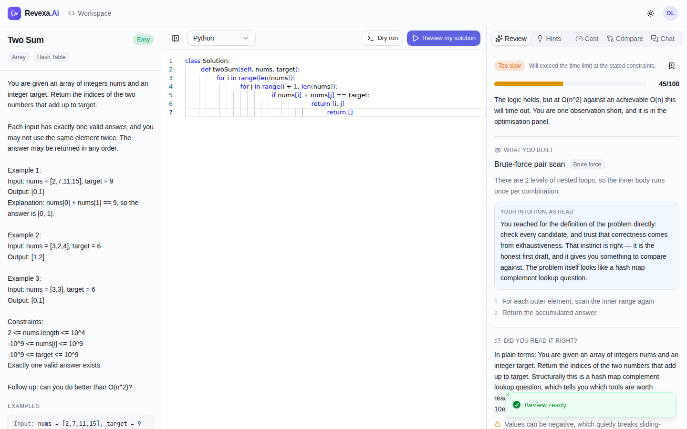
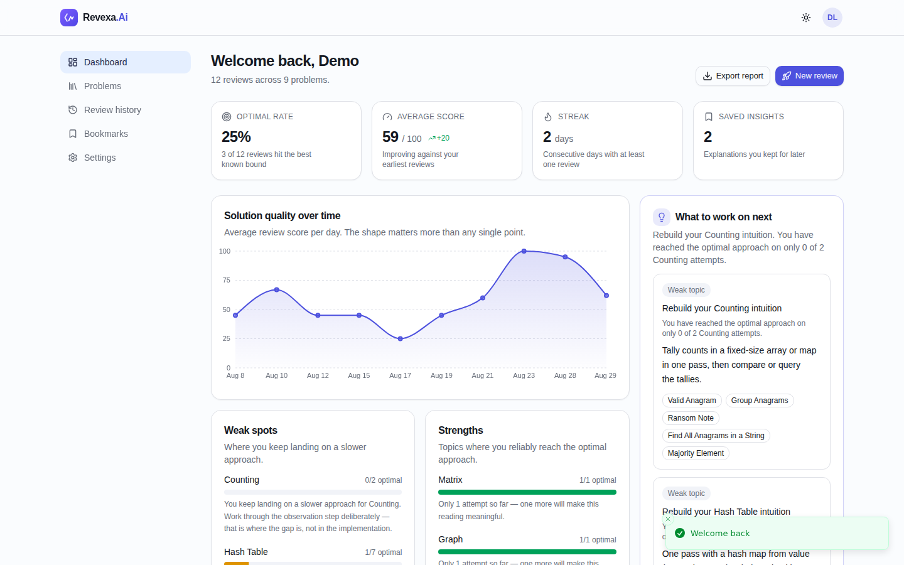
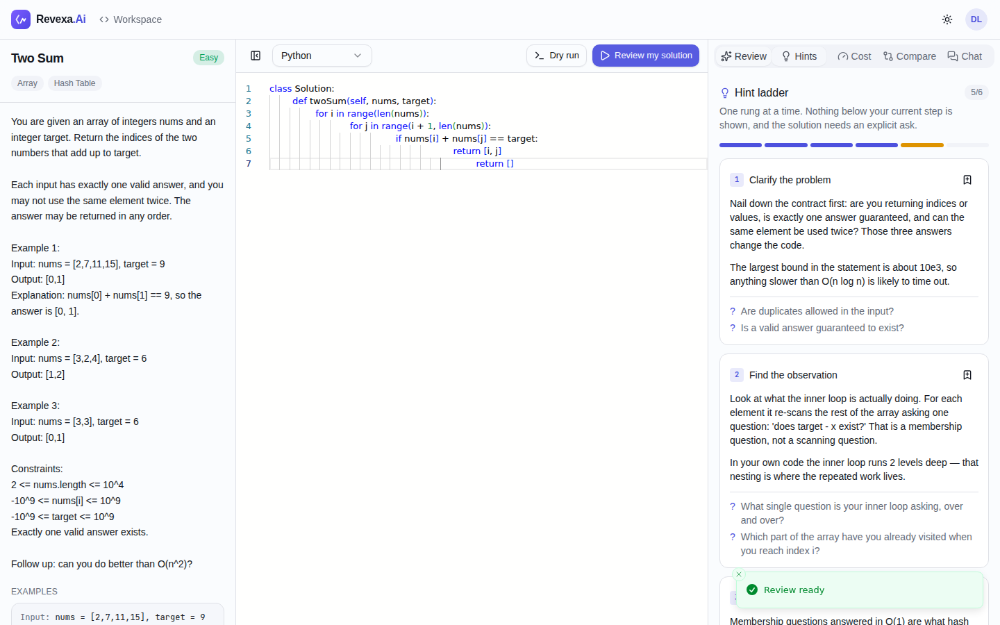
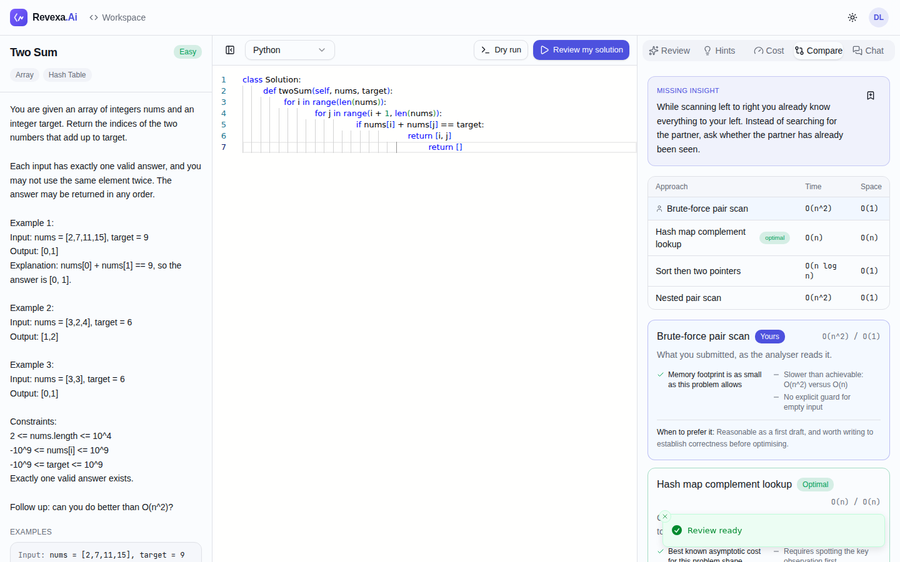
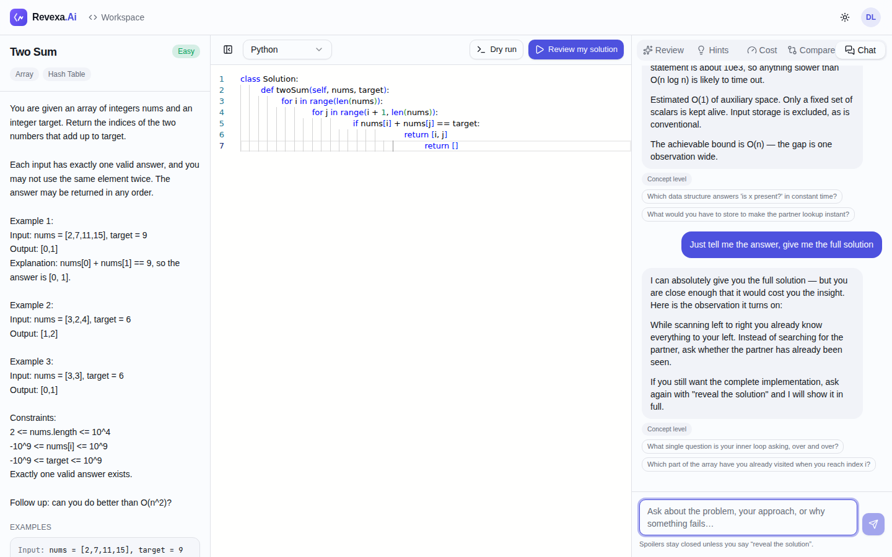
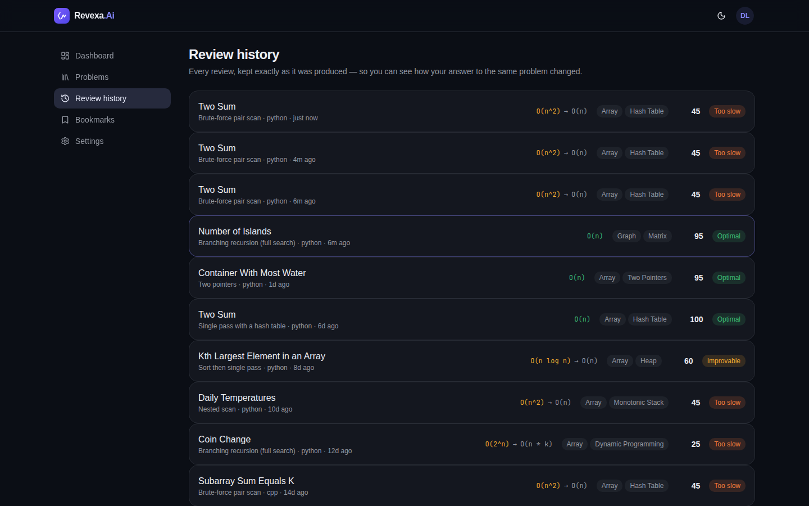
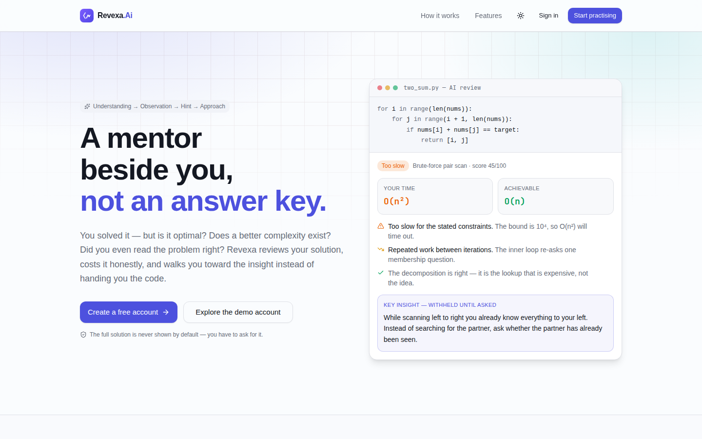

# Revexa.Ai

**An AI mentor for competitive programming — understanding first, answers last.**

Getting *Accepted* tells you the tests passed. It does not tell you whether your solution is
optimal, whether it collapses at the real constraints, or which observation you walked straight
past. Revexa reads your solution, costs it honestly, and walks you toward the insight instead of
handing you the code.

The product rule the whole system is built around: **the complete solution is never revealed by
default.** That constraint is enforced in the API, not just the interface — a client cannot talk
its way past the hint gate.



---

## Quick start

### With Docker (Postgres + Redis + API + web)

```bash
cp .env.example .env      # every value already has a working default
docker compose up --build
```

- Web app → <http://localhost:3000>
- API docs → <http://localhost:8080/swagger-ui.html>
- Sign in with the seeded demo account: **demo@revexa.ai** / **revexa-demo**

### Without Docker

```bash
# Terminal 1 — API on :8080 (in-memory H2, no external services needed)
cd backend && mvn spring-boot:run

# Terminal 2 — web app on :3000
npm install
npm run dev
```

**No AI credentials are required.** The backend ships with an offline provider (see
[The offline engine](#the-offline-engine)) so the whole product works end to end out of the box.

---

## What it does

| Feature | What you actually get |
| --- | --- |
| **AI code review** | The approach named and read back to you, the intuition it implies, correctness and edge-case findings, and a 0–100 quality score. |
| **Complexity analysis** | Time and space estimated from the structure of your code, with a per-construct cost breakdown, a confidence figure, and the achievable bound beside the measured one. |
| **Progressive hints** | Six rungs — clarify, observe, concept, direction, pseudocode, solution. One rung per request; the last needs an explicit reveal. |
| **Context-aware chat** | Already knows the problem and your current editor contents. Answers with a sharper question when you are close. |
| **Solution comparison** | Your approach beside the optimal one and real alternatives, with trade-offs and the single missing observation named. |
| **Progress tracking** | Weak topics, recurring mistakes, complexity mix, hint dependency and an improvement trend — all derived from your stored reviews. |
| **Learning reports** | The whole picture exported as Markdown, ready to paste into a study log. |
| **Workspace** | Problem statement, Monaco editor and every mentor panel in one distraction-free view. |

Nine languages are supported for analysis: Python, Java, C++, C, JavaScript, TypeScript, Go, Rust,
Kotlin and C#.

### Screenshots

| | |
| --- | --- |
|  **Progress dashboard** — mastery, mistakes and an improvement trend derived from real reviews |  **Hint ladder** — five rungs revealed, the sixth still gated |
|  **Comparison** — your approach beside the optimal one, with the missing insight named |  **Chat** — refuses a loose "just tell me the answer" and offers the observation instead |
|  **Review history** — dark mode throughout |  **Landing page** |

---

## Architecture

```
revexa/
├── backend/            Spring Boot 3.5 · Java 21 · REST · JWT · Flyway · Postgres/Redis
├── frontend/           Next.js 16 · React 19 · TypeScript · Tailwind v4 · shadcn/ui · TanStack Query
├── packages/core/      Shared domain types, API client and mentor rules (no UI framework imports)
├── scripts/            End-to-end smoke test
└── docker-compose.yml
```

The backend is organised as vertical slices that only talk to each other through service
interfaces, so any slice can be lifted into its own deployable without touching the ones around it:

| Slice | Responsibility |
| --- | --- |
| `identity` | Accounts, JWT issue/refresh, profile |
| `catalog` | Problems and the `PracticePlatformProvider` abstraction |
| `practice` | Submissions, reviews, hint sessions, chat threads, bookmarks |
| `intelligence` | The LLM abstraction, the six-stage pipeline and the offline engine |
| `progress` | Analytics, recommendations, exportable reports |
| `sandbox` | The code-execution seam |
| `core` | Cross-cutting: config, errors, security, rate limiting, caching |

Detailed design notes and the reasoning behind each decision live in
[`docs/architecture.md`](docs/architecture.md).

### Not coupled to the web

The business logic lives in the backend; everything a *client* needs — domain types, the API client,
the hint-ladder rules, complexity ordering, language definitions — lives in `packages/core`, which
imports nothing from `next`, `react` or the DOM. The client takes an injectable `fetch` and an
injectable `TokenStore`, so a React Native app, an Electron build and a VS Code extension consume
exactly the same file the web app does.

### The AI pipeline

Six stages, each with its own prompt, its own JSON contract and its own failure mode:

```
problem-understanding ─┐
solution-analysis ─────┼─→ (in parallel) ─→ optimization-detection ─→ assembled review
complexity-analysis ───┘
hint-generation · chat-assistance · solution-comparison   (independent entry points)
```

Splitting the work keeps each prompt small and focused, which is both cheaper and markedly more
reliable than asking one prompt to do everything. Every stage returns structured JSON, so panels
render specific fields rather than a wall of prose. Model output is parsed by a tolerant extractor
that recovers a balanced JSON object from fenced blocks or surrounding prose — and ignores braces
inside string literals, which matters when the payload embeds code.

### Provider abstraction

Everything above `LlmClient` is written against that interface alone, so switching vendors is a
configuration change rather than a code change:

```yaml
revexa:
  ai:
    provider: heuristic     # or: anthropic | openai
    fallback-to-heuristic: true
```

`anthropic` and `openai` call the hosted APIs. If a hosted provider errors, times out, or returns
output that does not match the schema, the gateway degrades to the offline engine and marks the
result — a deterministic review beats a spinner that never resolves.

### The offline engine

The `heuristic` provider is not a stub. It implements the same `LlmClient` interface and answers the
same stage contracts, but its answers come from static analysis plus a curated pattern catalogue:

- **`StaticCodeAnalyzer`** strips comments and string literals, then reads loop nesting (brace- and
  indentation-scoped), recursion and its branching factor, memoisation, the data structures in play,
  empty-input guards, overflow-prone midpoints and more.
- **`ConstraintReader`** pulls the bound on *input size* out of the statement — deliberately
  preferring `nums.length <= 10^4` over `-10^9 <= nums[i] <= 10^9`, because only one of those tells
  you the intended complexity.
- **`PatternCatalog`** loads [14 algorithmic patterns](backend/src/main/resources/knowledge/patterns.json)
  from JSON — each with its optimal bounds, key insight, six-rung hint ladder, Socratic questions,
  alternatives and practice problems. Adding a pattern is a data change.
- **`SolutionInspector`** turns those facts into the approach summary, the findings and the
  complexity estimate, with an explicit confidence score.

This is what makes the prototype demonstrable with no API key, gives hosted providers a fallback,
and gives the test suite something stable to assert against.

### Practice platform integration

`PracticePlatformProvider` is the seam to the outside world, with three implementations:

| Provider | How it works |
| --- | --- |
| **Manual entry** | Paste a statement from anywhere. Parses the constraints block, worked examples and likely topics. |
| **LeetCode link** | Reads the slug and canonical title from a URL you supply; the text comes from the page you already have open. |
| **Browser extension** | Accepts a structured payload captured in the user's own authenticated session. |

No implementation scrapes a site or calls a private API. LeetCode publishes no public problem API and
scraping it would breach their terms, so the honest options are a paste or a user-authorised
extension — and the UI says so rather than promising an integration the server does not have. When a
platform later offers an official API, it becomes one more implementation of this interface.

---

## Security and operations

- **Auth** — BCrypt password hashing, stateless HS256 JWTs, a short-lived access token plus a
  refresh token, and transparent single-flight refresh in the client.
- **Rate limiting** — three tiers (anonymous auth by IP, expensive AI endpoints per user, everything
  else), in-memory by default and Redis-backed when `revexa.cache.mode=redis`. A Redis outage
  degrades to the local limiter rather than taking the API down.
- **Caching** — identical AI requests are cached (Caffeine or Redis) since the model call is the
  expensive part of a request.
- **Errors** — one error envelope for every endpoint; internals are never leaked to clients.
- **Ownership** — every read is scoped to the calling user; one account cannot read another's
  problems, submissions or reviews.
- **Migrations** — Flyway, in the SQL subset shared by PostgreSQL and H2's PostgreSQL compatibility
  mode, so local and production schemas come from the same files.

---

## Testing

```bash
cd backend && mvn test        # 40 tests: analysis accuracy, spoiler policy, HTTP workflow
npm test --workspace packages/core
npm run typecheck --workspace frontend
./scripts/smoke-test.sh       # walks the whole loop against a running API
```

The backend suite covers the parts that are easy to get quietly wrong: loop-depth detection across
brace- and indentation-scoped languages, recursion detection that is not fooled by a helper called
above its declaration, a graph traversal with a visited set being linear rather than exponential,
constraint bounds preferring size over value ranges, JSON recovery from messy model output, and —
most importantly — that the hint ladder and the chat both refuse to reveal a solution that was not
explicitly asked for.

---

## What is deliberately not real

Honest limits, stated up front:

- **Code execution is simulated.** `SimulatedSandbox` performs a static dry run and says so in every
  response. Running untrusted code safely is infrastructure (process isolation, resource caps, a
  hardened image), not application logic — so the prototype ships the interface and a clearly
  labelled implementation. A Judge0, Piston or Firecracker runner drops in behind
  `CodeExecutionSandbox` without any caller changing.
- **Tokens live in `localStorage`.** Fine for a prototype; a production deployment moves the refresh
  token into an httpOnly, SameSite cookie — a change confined to one class.
- **Complexity figures are estimates.** They are derived from code structure, not execution, and
  every one is reported with a confidence score and the reasoning that produced it.

---

## License

MIT
